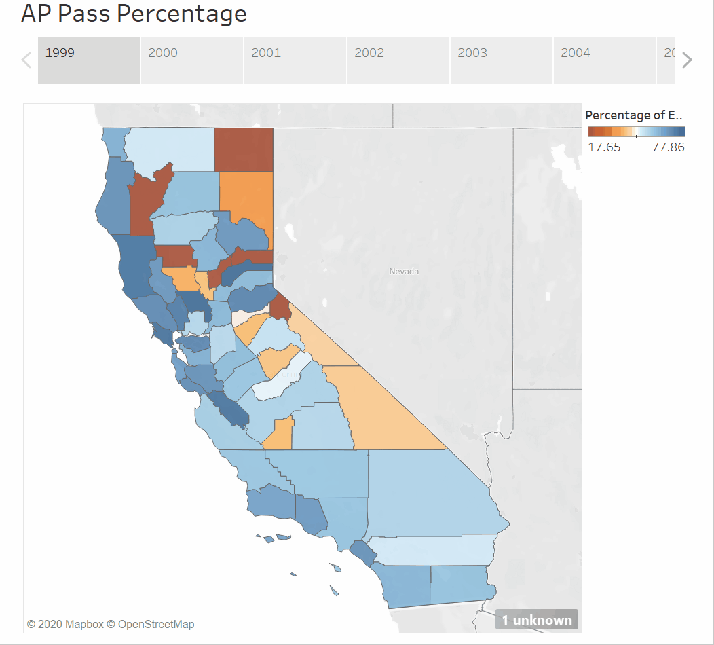

# Visualizing California AP Pass Percentage in Tableau 

The choropleth map divides the state of California into its respective counties and, on hover, displays the county's name and AP exam pass percentage for that year. In addition, the map contains an orange-white-blue gradient for low-to-high percentage range. The color gradient is indicative of how the counties performed with respect to one another for the given year.

