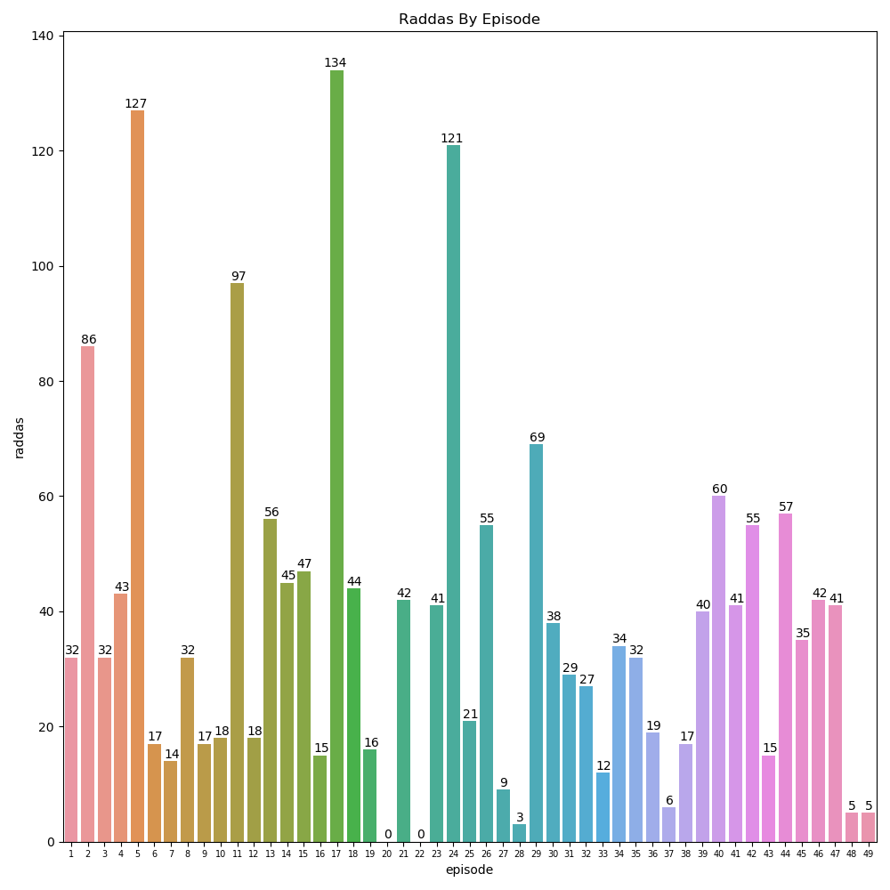

# Visualizing Shnitzel's Radda

### Code for this project can be found at [this repository](https://github.com/a-camarillo/chowder-visualization)

Chowder is a Cartoon Network show which ran from 2007 to 2010 and, upon rewatching, is likely the cause of my "terrible" sense of humor. One of the characters featured in Chowder is Shnitzel, the gray rock monster pictured to the left. Unlike other characters, Shnitzel's speaking consists entirely of one word, Radda. I was curious to see just how many times Shnitzel said Radda over the course of the show and came up with the following visual.

&nbsp;

